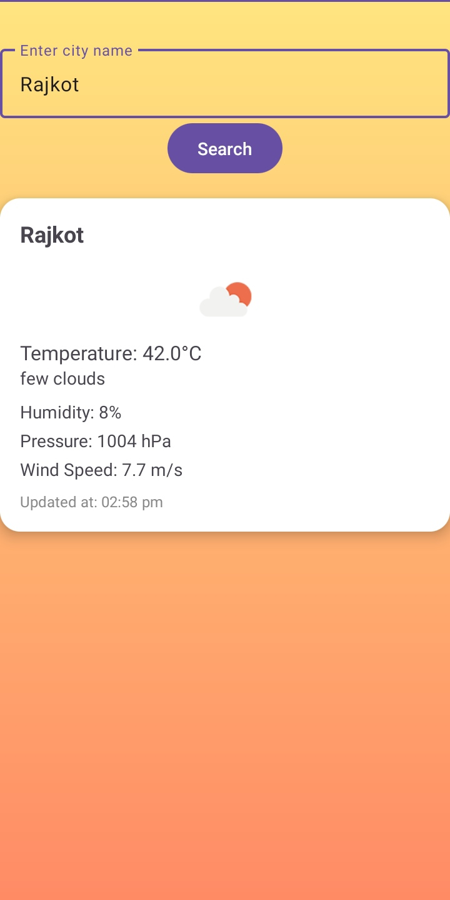

# 🌤️ WeatherApp

WeatherApp is an Android application that allows users to search and view real-time weather information by city name. The app features a clean and modern user interface with background gradients, animated icons, and a progress bar to enhance user experience.

---

## 🌟 Features

- 🔍 **City Search**: Users can search weather details by entering the city name.
- 🌡️ **Real-time Weather Data**: Displays current temperature, humidity, pressure, wind speed, and weather description.
- 🎨 **Background Gradient**: Beautiful background gradients that match weather conditions.
- 📱 **Responsive UI**: Modern, mobile-friendly, and adaptable across screen sizes.
- ⏳ **Progress Bar**: Shows a loading animation during API data fetching.

---

## 📸 Screenshots

> _Add screenshots of the app in this section for visual reference._

- **Home Screen**  


- **Weather Details Displayed**  


---

## 🛠 Requirements

To build and run the app, you'll need the following:

- Android Studio (Electric Eel / Giraffe / Ladybug edition or later)
- Android SDK (API Level 24 or higher)
- Gradle 7.0+
- An active internet connection
- OpenWeatherMap API Key (free tier available)

---

## 🚀 Setup Instructions

Follow these steps to get the WeatherApp up and running locally:

1. **Clone the repository**
   ```bash
   git clone https://github.com/yourusername/WeatherApp.git
   ```

2. **Open in Android Studio**
   - Launch Android Studio.
   - Select **"Open an existing project"**.
   - Navigate to the cloned `WeatherApp` folder and open it.

3. **Configure the API Key**
   - Go to `res/values/strings.xml`.
   - Add your OpenWeatherMap API key like below:
     ```xml
     <string name="weather_api_key">YOUR_API_KEY_HERE</string>
     ```

4. **Sync Gradle**
   - Let Android Studio sync and download all dependencies.

5. **Run the App**
   - Connect an Android device or start an emulator.
   - Press **Run ▶** to build and launch the app.

---

## 🧩 Code Overview

- **MainActivity.java / MainActivity.kt**
  - Entry point of the app. Handles UI logic and API integration.

- **activity_main.xml**
  - Contains UI layout including EditText (for city search), TextViews (for displaying data), ImageView (for weather icon), and a ProgressBar.

- **WeatherService.kt / RetrofitHelper.kt**
  - Contains Retrofit setup and API call methods to OpenWeatherMap.

- **Model Classes**
  - Data classes for mapping JSON responses (e.g., `WeatherResponse`, `Main`, `Wind`).

---

## 📦 Libraries Used

- [Retrofit](https://square.github.io/retrofit/) – for REST API calls.
- [Gson Converter](https://github.com/square/retrofit/tree/master/retrofit-converters/gson) – for parsing JSON responses.
- [ConstraintLayout](https://developer.android.com/reference/androidx/constraintlayout/widget/ConstraintLayout) – for flexible UI design.
- [Material Components](https://material.io/components) – for modern UI elements like buttons, progress bars, and card views.

---

## 🌐 API Reference

- **OpenWeatherMap API**
  - Endpoint: `https://api.openweathermap.org/data/2.5/weather?q={city}&appid={API_KEY}&units=metric`
  - Documentation: [https://openweathermap.org/current](https://openweathermap.org/current)

---

## 🛠 Troubleshooting

| Issue                                | Solution                                                                 |
|-------------------------------------|--------------------------------------------------------------------------|
| `401 Unauthorized` Error            | Make sure you have added a valid API key in `strings.xml`.              |
| App crashes on startup              | Ensure internet permission is declared in `AndroidManifest.xml`.        |
| Gradle sync fails                   | Try `File > Invalidate Caches / Restart` in Android Studio.             |
| API response is null or incorrect   | Check if the city name input is correct and URL encoding is handled.    |

---

## 🤝 Contributing

Contributions are welcome! Here's how you can help:

1. Fork the repository.
2. Create a new branch (`git checkout -b feature-branch`).
3. Make your changes and commit (`git commit -m 'Add feature'`).
4. Push to your fork (`git push origin feature-branch`).
5. Create a Pull Request and describe your changes.

---

## 📄 License

This project is licensed under the [MIT License](LICENSE).

---

## 🙏 Acknowledgments

- [OpenWeatherMap](https://openweathermap.org/) for providing free weather data APIs.
- [Android Developers](https://developer.android.com/) documentation for official Android guidance.
- [Material Design](https://material.io/) for UI inspiration and components.
